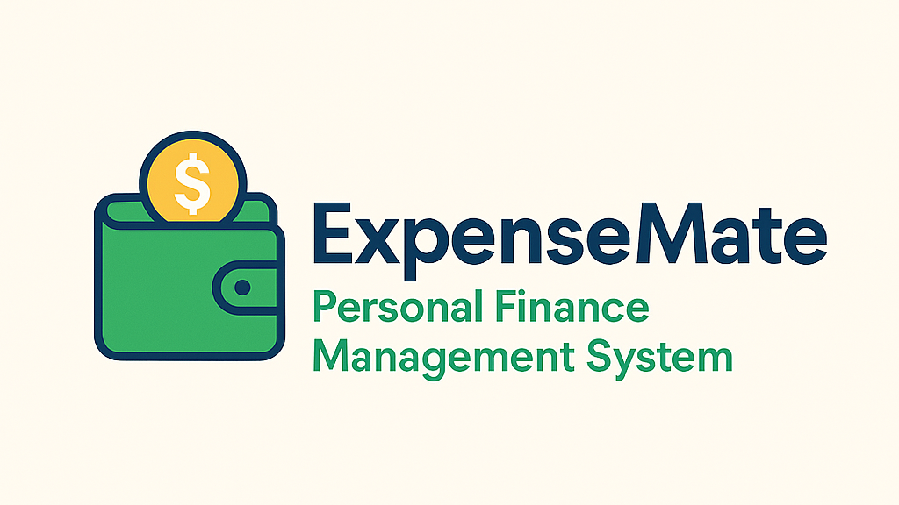

<div align="center">

# ExpenseMate - Personal Finance Management System

[](https://php.net/)
[](https://www.mysql.com/)
[](https://getbootstrap.com/)
[](https://jquery.com/)
[](LICENSE)

<h1 align="center">
  
</h1>

[View Demo](https://your-demo-link.com) • 
[Report Bug](https://github.com/yourusername/expensemate/issues) • 
[Request Feature](https://github.com/yourusername/expensemate/issues)

</div>

## ✨ Overview

ExpenseMate is a comprehensive personal finance management system that helps you track expenses, income, and manage your financial categories with ease. Built with modern web technologies, it provides an intuitive interface for managing your personal or business finances.

## 🚀 Features

- **Expense Tracking** - Record and manage your daily expenses
- **Income Management** - Track various sources of income
- **Category Management** - Organize expenses and income with customizable categories
- **Financial Statements** - Generate detailed income statements
- **Monthly Reports** - View and analyze current and last month's statements
- **Dashboard Analytics** - Visual representation of your financial data
- **User Management** - Secure user authentication and profile management
- **Responsive Design** - Works seamlessly on desktop and mobile devices
- **Export Functionality** - Export your financial data in various formats
- **Data Visualization** - Charts and graphs for better financial insights

## 🛠️ Prerequisites

- PHP 7.4 or higher
- MySQL 8.0 or higher
- Apache/Nginx web server
- XAMPP/WAMP/MAMP (for local development)

## 📦 Installation

1. Clone the repository
   ```bash
   git clone https://github.com/ridowanhossain/expensemate.git
   ```

2. Move the project to your web server directory
   ```bash
   # For XAMPP
   mv expensemate C:/xampp/htdocs/
   ```

3. Create a MySQL database and import the database schema
   ```sql
   CREATE DATABASE expensemate;
   ```

4. Configure the database connection in `includes/db.php`

5. Access the application through your web browser
   ```
   http://localhost/expensemate
   ```

## 📋 Project Structure

```
expensemate/
├── actions/             # PHP action handlers
├── assets/             # Static assets
│   ├── css/           # Stylesheets
│   ├── js/            # JavaScript files
│   └── img/           # Images
├── includes/          # PHP includes
├── index.php          # Entry point
└── README.md          # Documentation
```

## 💻 Usage

1. **Login/Register**
   - Create a new account or login with existing credentials

2. **Dashboard**
   - View financial overview and statistics
   - Quick access to common actions

3. **Manage Expenses**
   - Add new expenses
   - Categorize expenses
   - View expense history

4. **Track Income**
   - Record income sources
   - Manage income categories
   - Generate income reports

5. **Financial Reports**
   - View monthly statements
   - Analyze income vs expenses
   - Export financial data

## 🔒 Security

- Secure user authentication
- Password hashing
- SQL injection prevention
- XSS protection
- CSRF protection

## 🌐 Browser Support

- Chrome (latest)
- Firefox (latest)
- Safari (latest)
- Edge (latest)
- Opera (latest)

## 🤝 Contributing

1. Fork the repository
2. Create your feature branch (`git checkout -b feature/AmazingFeature`)
3. Commit your changes (`git commit -m 'Add some AmazingFeature'`)
4. Push to the branch (`git push origin feature/AmazingFeature`)
5. Open a Pull Request

## 📄 License

This project is licensed under the MIT License - see the [LICENSE](LICENSE) file for details.

## 👥 Authors

- **Your Name** - *Initial work* - [YourGitHub](https://github.com/yourusername)

## 🙏 Acknowledgments

- [Bootstrap](https://getbootstrap.com)
- [jQuery](https://jquery.com)
- [Font Awesome](https://fontawesome.com)

---

<div align="center">

**[⬆ back to top](#expensemate---personal-finance-management-system)**

Made with ❤️ by [Your Name](https://github.com/yourusername)

</div>